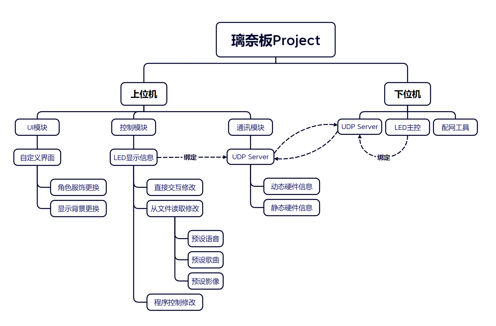

## 2. 总体设计

### 2.1 系统功能

整个项目系统可以被分为上位机和下位机两个子系统。每个子系统下又有各个细分模块。



#### 2.1.1 上位机功能

实现上位机功能的载体为控制软件。

- **UI模块：**提供给用户自定义控制软件显示界面的功能。
- **控制模块：**提供了多种对LED显示信息的修改方法。
- **通讯模块：**提供了与下位机的通讯功能。

#### 2.1.2 下位机功能

实现下位机功能的载体为硬件驱动。测试软件亦可以模拟实现下位机的功能。

- **UDP Server：**提供与上位机的通讯功能。
- **LED主控：**提供对LED灯显示情况的控制功能。测试软件使用UI对LED灯显示情况进行模拟。
- **配网工具：**帮助下位机连接到指定的无线网络。测试软件直接使用主机网络的ip作为UDP Server地址，因而不包含此一功能。

### 2.2 系统软硬件平台

#### 2.2.1 系统开发平台

- **控制软件：**Unity 2022.3.15f1c1，API兼容级别`.NET Framework`直接使用或经过改写的第三方库如下：

    - **页面动画：**[Demigiant/dotween: A Unity C# animation engine. HOTween v2](https://github.com/Demigiant/dotween)
    - **口型同步：**[hecomi/uLipSync: MFCC-based LipSync plug-in for Unity using Job System and Burst Compiler](https://github.com/hecomi/uLipSync)

- **硬件驱动：**有第一代、第二代共两代驱动软件，分别适用于不同的硬件平台。硬件平台、板型、架构、使用库信息通过项目配置文件展示。

    - **RinaChanBoard Hardware：**PlatformIO Project

        ```ini
        [env:nodemcuv2]
        platform = espressif8266
        board = nodemcuv2
        framework = arduino
        monitor_speed = 9600
        lib_deps = 
        	fastled/FastLED@^3.6.0
        ```

    - **RinaChanBoard Hardware V2：**PlatformIO Project

        ```ini
        [env:esp32dev]
        platform = espressif32
        ;board = esp32dev
        board = esp32s3box
        framework = arduino
        monitor_speed = 115200
        monitor_rts = 0
        monitor_dtr = 0
        lib_deps = 
        	fastled/FastLED@^3.6.0
        	wnatth3/WiFiManager@^2.0.16-rc.2
        ```

- **测试软件：**C++20 & QT 6.8.0，使用Cmake编译（最低版本3.29）。

#### 2.2.2 系统运行平台

- **控制软件：**目前支持Windows和Android，计划支持iOS。

    | 操作系统                                    | 支持情况 | 备注                   |
    | ------------------------------------------- | -------- | ---------------------- |
    | Windows 7 (SP1+), Windows 10 and Windows 11 | ✅        |                        |
    | Android 10 或更高                           | ✅        | 目标架构为ARMv7和ARM64 |

- **硬件驱动：**两代硬件驱动的支持情况如下：

    | 驱动版本                  | Platform                 | Board               | 备注     |
    | ------------------------- | ------------------------ | ------------------- | -------- |
    | RinaChanBoard Hardware    | ESP8266（espressif8266） | nodemcuv2           | 不再维护 |
    | RinaChanBoard Hardware V2 | ESP32S（espressif32）    | esp32dev→esp32s3box |          |

- **测试软件：**Windows 7 (SP1+), Windows 10 and Windows 11。

### 2.3 关键技术

#### 2.3.1 无线通信

在本项目中，上位机和下位机之前的通讯使用**UDP协议**来完成。这是基于需要即时响应的需求，牺牲了一部分可靠性来换取更高的性能。基于硬件条件的限制，经过测试后，以**0.1s**作为UDP包发送和接收的最小间隔，称为1**帧（frame）**。UDP协议没有重传机制，当用户操作上位机发送离散控制信息时，需要用户自行确认硬件情况来检查包传送到位，如出现丢包需要用户重复操作来进行重传；当上位机程序发送连续控制信息时出现丢包不会进行重传，而是直接用后续的控制信息进行覆盖。

上位机和下位机需要在同一局域网下才能够进行通信，对应UDP Server的IP和端口情况如下表所示：

| 软件            | IP地址         | 端口 |
| --------------- | -------------- | ---- |
| 上位机-控制软件 | 主机本地IP地址 | 4321 |
| 下位机-硬件驱动 | 主控本地IP地址 | 1234 |
| 下位机-测试软件 | 主机本地IP地址 | 1234 |

具体的配网流程参见**[5.3 配网工具](./5.下位机系统功能设计)**章节；具体的上下位机通讯过程参见**[7.2 UDP服务](./7.上位机组件设计.md)**章节。

#### 2.3.2 口型同步

口型同步（LipSync）技术通过分析**梅尔倒谱系数（MFCC）**数据,解析音频中的元音信息（日语或汉语中的a、i、u、e、o），并且将其反应到璃奈板的口型上。在用户层面，该技术可以检测用户的麦克风输入来实时控制璃奈板的表情来模拟说话的效果。在开发者层面，该技术可以辅助编写时间轴文件，提升开发效率。

该部分内容较多，由于篇幅原因不在本篇文档展示，详情可查阅文档：**[附录1-口型同步](./附录1-口型同步.md)**。