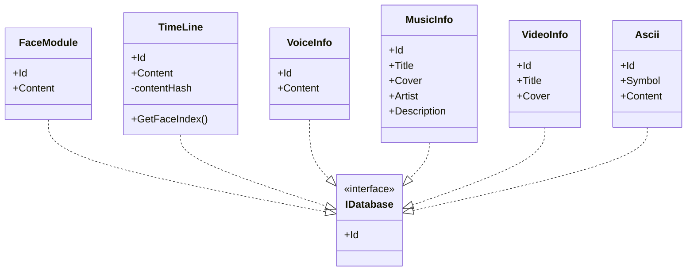
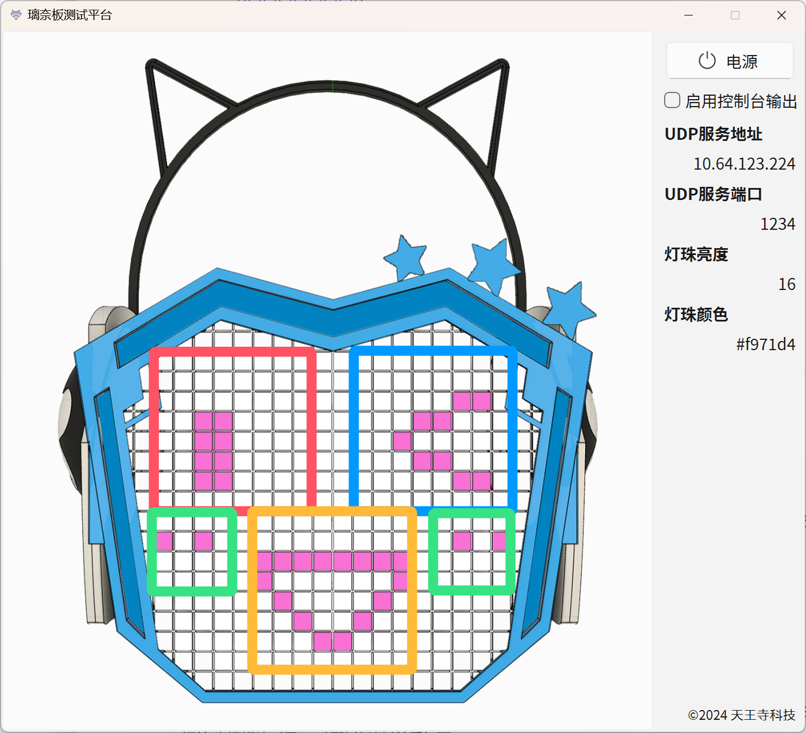

## 3. 数据结构设计

在本项目中，所有的数据结构代码位于根目录`RinaChanBoardOperationCenter/Assets/Scripts/DataStructs`。所有数据结构均可以被序列化和反序列化。

### 3.1 `IDatabase`接口

这个接口使得系统能够从json文件读取数据并序列化为静态字典数据库。接口提供的属性`Id`作为字典的键，而类型本身作为字典的值。仅在上位机中使用。

```c#
public interface IDatabase
{
    int Id { get; }
}
```

实现了该接口的数据结构如以下UML图所示：



### 3.2 LED数据

这一部分的数据结构主要用于控制LED灯阵的显示情况，在上下位机中均有使用。

#### 3.2.1 脸字符串`FaceString`

长度为288的字符串，用于直观展示所有LED灯的开闭状态，支持最大分辨率为16×18的LED矩阵。由于璃奈板硬件仅包含270颗灯珠，因而字符串的每一位通过以下映射表（以下位机为例，上位机为C#语法的`List<List<int>>`）来映射到灯珠的id：

```c++
const int led_map[][18]=
{
    { -1, -1, 38, 39, 70, 71,102,103,134,135,166,167,198,199,230,231, -1, -1},
    { -1, 10, 37, 40, 69, 72,101,104,133,136,165,168,197,200,229,232,259, -1},
    {  9, 11, 36, 41, 68, 73,100,105,132,137,164,169,196,201,228,233,258,260},
    {  8, 12, 35, 42, 67, 74, 99,106,131,138,163,170,195,202,227,234,257,261},
    {  7, 13, 34, 43, 66, 75, 98,107,130,139,162,171,194,203,226,235,256,262},
    {  6, 14, 33, 44, 65, 76, 97,108,129,140,161,172,193,204,225,236,255,263},
    {  5, 15, 32, 45, 64, 77, 96,109,128,141,160,173,192,205,224,237,254,264},
    {  4, 16, 31, 46, 63, 78, 95,110,127,142,159,174,191,206,223,238,253,265},
    {  3, 17, 30, 47, 62, 79, 94,111,126,143,158,175,190,207,222,239,252,266},
    {  2, 18, 29, 48, 61, 80, 93,112,125,144,157,176,189,208,221,240,251,267},
    {  1, 19, 28, 49, 60, 81, 92,113,124,145,156,177,188,209,220,241,250,268},
    {  0, 20, 27, 50, 59, 82, 91,114,123,146,155,178,187,210,219,242,249,269},
    { -1, 21, 26, 51, 58, 83, 90,115,122,147,154,179,186,211,218,243,248, -1},
    { -1, 22, 25, 52, 57, 84, 89,116,121,148,153,180,185,212,217,244,247, -1},
    { -1, 23, 24, 53, 56, 85, 88,117,120,149,152,181,184,213,216,245,246, -1},
    { -1, -1, -1, 54, 55, 86, 87,118,119,150,151,182,183,214,215, -1, -1, -1},
};
```

映射公式为：

- 下位机

    ```c++
    if (led_map[i / 18][i % 18] == -1) return;
    leds[led_map[i / 18][i % 18]] = face_string[i] == '1' ? color : CRGB::Black
    ```

- 上位机

    ```c#
    if (LedTool.ledMap[i / 18][i % 18] == -1) return;
    leds[LedTool.ledMap[i / 18][i % 18]].color = faceString[i] == '1' ? LedOnColor : LedOffColor
    ```

#### 3.2.2 颜色数据`Color`

以RGB的形式用于直观展示所有LED灯的显示颜色。在下位机中使用三个`unsigned int`数储存，并在需要时构造成`CRGB`类型来使用；在上位机中，使用`UnityEngine.Color`类型来储存和使用。

#### 3.2.3 亮度数据`Bright`

以0-255之间的整型数来表示灯珠的显示亮度，在上下位机中均使用`int`数来储存。

虽然技术上能够支持0-255的亮度区间，但是基于用户佩戴体验、电池电量续航、电路安全等多方面因素考虑，最高只支持亮度为128的亮度值。同时为了简化操作，上位机只提供了四档的亮度调节：

| 亮度名 | 亮度值 |
| ------ | ------ |
| 正常   | 16     |
| 輝く   | 32     |
| 眩しい | 64     |
| 光害   | 128    |

这是由于在实际测试中发现针对亮度的控制需求不必像颜色那样细节（比如亮度值16和亮度值17实际上并没有什么区别），因而仅依靠四档的亮度已经能够覆盖大部分的使用场景。默认情况下使用正常的亮度值16已经足够使用，只有在外部环境较亮时才会用到更高的亮度。更何况更高的亮度也会使得佩戴者的眼部感到不适。

### 3.3 表情数据

虽然使用`FaceString`已经可以用来表示璃奈板的显示表情了，但是冗长的字符串显然会增加开发压力。因而在上位机中引入了表情数据结构来呈现璃奈板的现实情况。

#### 3.3.1 表情模块`FaceModule`

表情模块是表情的基本组成元素。分为以下四种类型：

- **左眼（Leye）：**图中红色部分，行0-7，列0-7；
- **右眼（Reye）：**图中蓝色部分，行0-7；列10-17；
- **嘴巴（Mouth）：**图中黄色部分，行8-15；列5-12；
- **脸颊（Cheek）：**图中绿色部分，行8-11；列0-3 & 14-17；



`FaceModule`类型实现了`IDataBase`接口，可以从以下格式的json文件中读取并序列化为字典数据库：

```json
[
    {
        "id": 0,
        "content": [
            [0,0,0,0,0,0,0,0],
            [0,0,0,0,0,0,0,0],
            [0,0,0,0,0,0,0,0],
            [0,0,0,0,0,0,0,0],
            [0,0,0,0,0,0,0,0],
            [0,0,0,0,0,0,0,0],
            [0,0,0,0,0,0,0,0],
            [0,0,0,0,0,0,0,0]
        ]
    },
    {
        "id": 400,
        "content": [
            [0,0,0,0],
            [0,0,0,0],
            [0,0,0,0],
            [0,0,0,0]
        ]
    }
]
```

- **id**是表情模块的唯一标识符，0代表空表情；101-199范围内代表左眼表情；201-299范围内代表右眼表情；301-399范围内代表嘴巴表情；400-499范围内代表脸颊表情（400为空脸颊）；
- **content**代表对应模块LED的实际显示情况，`content[i][j] = n`表示在该表情模块第i行第j列的LED灯的开闭状态为`n`，其中`n=1`代表LED灯开，`n=0`代表LED灯关。左眼、右眼、嘴巴的content大小都是8×8，而脸颊是4×4。脸颊的显示是对称的，json文件记录的是右眼同侧脸颊的显示情况，左眼同侧脸颊的现实情况为文件记录的镜像。

#### 3.3.2 表情`Face`

通过表情模块的组合，就可以构成表情。`Face`类型不实现`IDatabase`接口，但是其依然可以被以下json格式的内容反序列化，从而辅助构造其他相关的数据结构：

```json
{ "leye": 101, "reye": 201, "mouth": 303, "cheek": 400 }
```

其中`leye`代表左眼id，`reye`代表右眼id，`mouth`代表嘴巴id，`cheek`代表脸颊id。

### 3.4 时间轴数据

将一串表情串联起来并标上时间戳（帧号），就构成了时间轴。通过时间轴，上位机可以持续向下位机发出表情控制信息。

#### 3.4.1 时间轴单元`TimeLineUnit`

时间轴单元的构成为帧号+表情。两者的组合表示了在当前帧下应当显示的表情。`TimeLineUnit`类型不实现`IDatabase`接口，但是其依然可以被以下json格式的内容反序列化，从而辅助构造其他相关的数据结构：

```json
{
    "frame": 0,
    "face": { "leye": 101, "reye": 201, "mouth": 303, "cheek": 400 }
}
```

其中`frame`表示帧号，`face`表示表情。

#### 3.4.2 时间轴`TimeLine`

`TimeLine`类型实现了`IDataBase`接口，可以从以下格式的json文件中读取并序列化为字典数据库：

```json
[
    {
        "frame": 0,
        "face": { "leye": 102, "reye": 202, "mouth": 302, "cheek": 400 }
    },
    {
        "frame": 20,
        "face": { "leye": 101, "reye": 201, "mouth": 326, "cheek": 400 }
    }
]
```

但是时间轴类型的构造过程比其他实现了`IDataBase`接口的类型要复杂，因为上述的json的文件并没有提供时间轴的标识信息。时间轴类型包含了以下部分：

```c#
public class TimeLine : IDatabase
{
    public int Id { get; }
    public List<TimeLineUnit> Content { get; }
    private readonly Dictionary<int,int> contentHash = new();
    public TimeLine(int id, List<TimeLineUnit> content) {...}
    public int? GetFaceIndex(int frame) {...}
}
```

其中由json文件序列化的是`Content`部分，而`Id`作为标识符由媒体信息数据提供，时间轴类型的具体构造过程参考**上位机工具设计/数据库工具**章节。另外类型包含了一个`GetFaceIndex`方法，可以通过查询帧号来返回时间轴单元在`Content`中的索引，这个方法依赖字典`contentHash`来实现，配合计数器使用可以防止发送重复的表情，节约性能开销。

### 3.5 媒体信息数据

媒体信息类型都实现了`IDataBase`接口，可以从json文件中读取并序列化为字典数据库。

#### 3.5.1 语音信息`VoiceInfo`

记录预设语音的相关信息，包含以下成员：

- **Id：**预设语音的唯一标识符。
- **Content：**语音的文字内容，用于UI界面显示。

#### 3.5.2 歌曲信息`MusicInfo`

记录预设歌曲的相关信息，包含以下成员：

- **Id：**预设歌曲的唯一标识符。
- **Title：**歌曲的标题，用于UI界面显示。
- **Cover：**歌曲的文件标识符，用于定位封面，音频源，时间轴等信息。
- **Artist：**歌曲的演唱者，用于UI界面显示。
- **Description：**歌曲的描述信息，用于UI界面显示。

#### 3.53 影像信息`VideoInfo`

记录预设影像的相关信息，包含以下成员：

- **Id：**预设影像的唯一标识符。
- **Title：**影像的标题，用于UI界面显示。
- **Cover：**影像的文件标识符，用于定位视频源，时间轴等信息。

### 3.6 其他类型数据

#### 3.6.1 上位机UI显示数据`RinaChanDress`

用于存储上位机的UI显示信息，具体应用参考**上位机系统界面设计**章节。

#### 3.6.2 滚动文字字符数据`Ascii`

`Ascii`类型实现了`IDataBase`接口，可以从json文件中读取并序列化为字典数据库。主体为点阵ASCII字符用于辅助实现滚动文字功能（具体参见**系统功能设计**章节）。结构上类似于`FaceModule`，包含以下成员：

- **Id：**滚动文字字符的唯一标识符，与ASCII的值对应。
- **Symbol：**对应的ASCII字符。
- **Content：**点阵数据，大小为5×7。