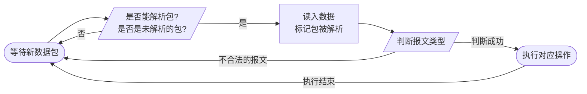
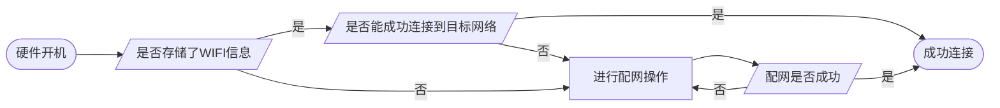

# 5. 下位机系统功能设计

实现下位机功能的载体为硬件驱动。测试软件亦可以模拟实现下位机的功能。

### 5.1 UDP Server

在硬件连接到网络后，下位机会自动在本地网络的1234端口启动一个UDP Server，准备监听从上位机发送的数据。监听的流程放在Arduino的`loop()`函数中轮询，如下图所示：

### 5.2 LED主控

UDP Server在判断出报文类型后，调用LED主控的函数来执行对应的操作，如下表所示：

| 报文           | 操作                                              |
| -------------- | ------------------------------------------------- |
| Face报文       | 解码为脸字符串后更新下位机LED显示表情             |
| Color报文      | 解码为颜色数据后更新下位机当前的颜色数据          |
| Bright报文     | 解码为亮度数据后更新下位机当前的亮度数据          |
| Face请求报文   | 将当前下位机LED显示表情编码为Face报文发送回上位机 |
| Color请求报文  | 将当前下位机颜色数据编码为Color报文发送回上位机   |
| Bright请求报文 | 将当前下位机亮度数据编码为Bright报文发送回上位机  |

针对LED的控制主要依赖`<FastLED.h>`库。该库可以对所有灯珠的亮度进行整体控制，也可以对每个灯珠的颜色进行单独控制。该库中灯珠颜色的表示类型为`CRGB`，`CRGB::Black`表示灯珠熄灭，主要依靠这个来判断LED的开闭情况。

### 5.3 配网工具

硬件驱动借助了[tzapu/WiFiManager: ESP8266 WiFi Connection manager with web captive portal](https://github.com/tzapu/WiFiManager)库来帮助主控芯片连接到WIFI网络，配网的流程如下图所示：

璃奈板硬件配备的网卡有两种模式：**基站模式（STA模式）**和**接入点模式（AP模式）**。STA模式下璃奈板与一般的主机一样连接到WIFI网络，并可以与同网络下的其他终端进行通信；AP模式下璃奈板自身会提供一个WIFI接入点供其他终端进行连接，承担类似于路由器或者手机热点的角色。璃奈板的配网逻辑基于这两种模式之间的切换。

璃奈板通电后首先进入到STA模式，尝试连接上次开机时连接到的网络。如果不能够成功连接，那么系统将会切换到AP模式，启动一个名为*RinaChanBoard*的WIFI热点，并且在`192.168.11.13`的地址启动一个HTTP Server作为配网的UI界面。当其他终端连接到该热点后即自动跳转到该页面。页面将会显示设备扫描到的所有可连接的WIFI网络（仅支持AP频段为**2.4GHz**频段的WIFI网络），随后用户可以直接选择并且输入密码信息。璃奈板确认WIFI名称和密码后会切换到STA模式尝试连接，如果成功连接，则配网流程结束，系统会存储下WIFI的名称和密码以供下次开机时再次连接使用；如果连接失败，系统切换回AP模式，重新开始配网流程。