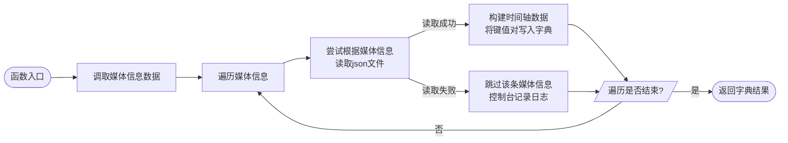

## 6. 上位机工具设计

在本项目中，所有的工具代码位于根目录`${OC}/Assets/Scripts/DataStructs`。

### 6.1 数据库工具`DatabaseTool`

静态类型`DatabaseTool`提供了一系列方法来将json文件序列化为实现了`IDatabase`接口的数据结构。json文件的序列化主要依赖`Newtonsoft.Json`库来实现。

#### 6.1.1 通用模板序列化函数

```c#
public static Dictionary<int, T> BuildDatabase<T>(string src) where T : IDatabase {...}
```

用户传入数据结构类型和json文件路径后，函数会返回一个静态字典数据库。字典的键为数据结构类型的`Id`属性，字典的值为数据结构类型本身。

#### 6.1.2 时间轴序列化函数

由于记录时间轴的json文件并不包含`Id`信息，所以序列化时间轴的函数需要调用媒体信息数据并从中获取`Id`作为字典的键。根据不同的媒体类型分别拆分成了三个独立的函数来实现功能：

```c#
public static Dictionary<int, TimeLine> BuildVoiceTimelineDatabase() {...}
public static Dictionary<int, TimeLine> BuildMusicTimelineDatabase() {...}
public static Dictionary<int, TimeLine> BuildVideoTimelineDatabase() {...}
```

函数的实现逻辑如下图所示：



#### 6.1.3 ASCII序列化函数

```c#
public static Dictionary<string, Ascii> BuildAsciiDatabase() {...}
```

其实现逻辑上与通用模板序列化函数一致，区别在于其使用的键是字符`Symbol`而非`Id`，因而也单列一个函数。

### 6.2 媒体工具`MediaTool`

静态类型`MediaTool`主要保存了一系列媒体信息数据字典和时间轴数据字典，同时还提供了一个方法来将帧号转换为分秒格式的字符串。

#### 6.2.1 媒体信息数据字典

```c#
public static readonly Dictionary<int, VoiceInfo> voiceInfos;	// 语音信息
public static readonly Dictionary<int, MusicInfo> musicInfos;	// 歌曲信息
public static readonly Dictionary<int, VideoInfo> videoInfos;	// 影像信息
```

#### 6.2.2 时间轴数据字典

```c#
public static readonly Dictionary<int, TimeLine> voiceTimeLines;	// 语音时间轴
public static readonly Dictionary<int, TimeLine> musicTimeLines;	// 歌曲时间轴
public static readonly Dictionary<int, TimeLine> videoTimeLines;	// 影像时间轴
```

#### 6.2.3 时间戳转换函数

```c#
public static string ConvertFramesToTime(float frames) {...}
```

- 参数：帧号`frame`
- 返回：时间戳字符串

在播放歌曲和影像时用于进度条UI的数字时间戳显示。

### 6.3 LED工具`LedTool`

静态类型`LedTool`主要用于辅助实现一些灯光控制的功能。

#### 6.3.1 映射表`ledMap`

用于将`FaceString`的每一位映射到对应Id的LED灯珠上。映射过程在前文已有提及，不再重复阐释。

#### 6.3.2 预设颜色

预设颜色包括默认颜色以及LoveLive!五代团的所有角色、小组、团体应援色。数据分别存储在两个二维列表中：

- `colorName`：预设颜色对应的角色名或小组名；
- `colorValue`：预设颜色对应的十六进制RGB数值；

#### 6.3.3 点阵信息

点阵信息主要用于修改特定区域的LED灯珠显示情况，包括表情模块点阵`faceModules`和ASCII字符点阵`asciis`。

#### 6.3.4 转换函数

转换函数主要用于一些数据之间的互相转换。

- **十六进制/二进制字符串互转：**`HexToBinary`和`BinaryToHex`。
- **十六进制字符串/`Unity.Color`互转：**`HexToColor`和`ColorToHex`。
- **十六进制字符串/bytes数组互转：**`HexToBytes`和`BytesToHex`。

### 6.4 口型同步工具`RinaLipSync`

详情可查阅文档：**[附录1-口型同步](./附录1-口型同步.md)**。