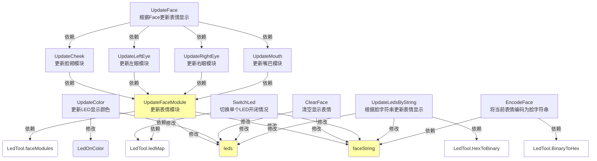
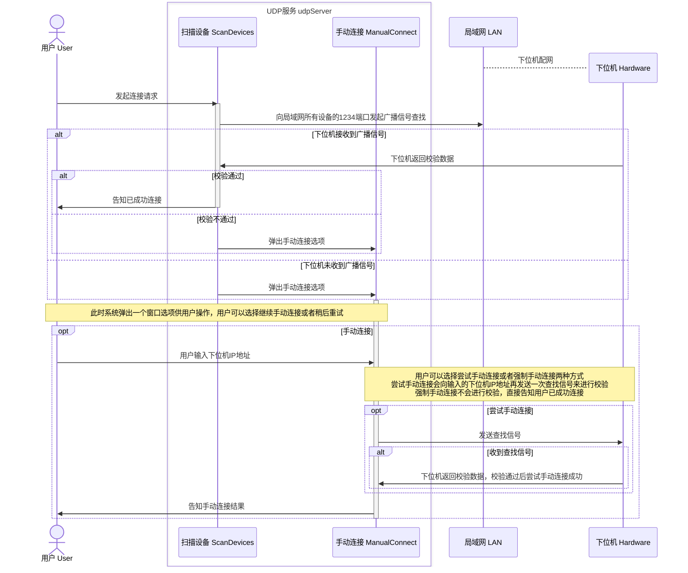
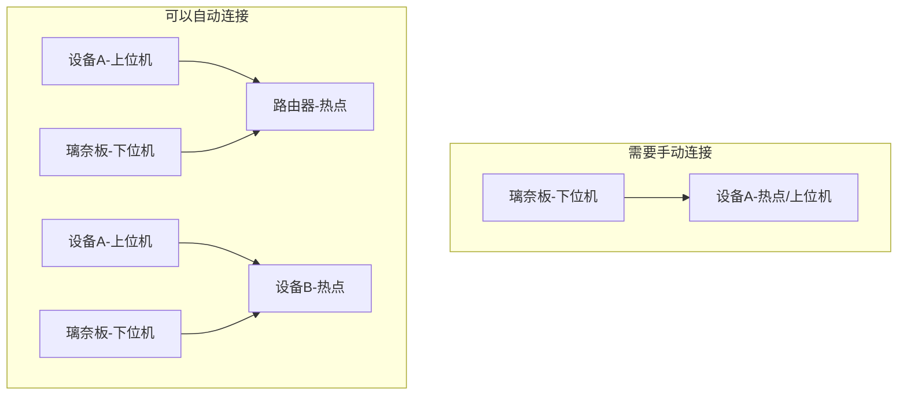
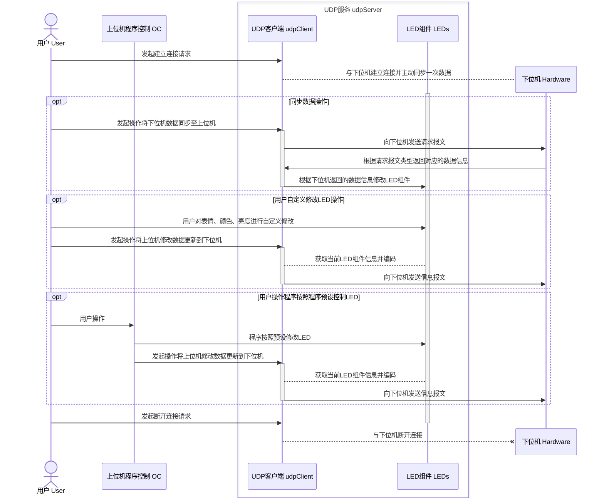

## 7. 上位机组件设计

在本项目中，所有的组件代码位于根目录`${OC}/Assets/Scripts/Components`。所有组件均继承自`MonoBehaviour`类。

### 7.1 LED组件`Leds`

该组件主要控制上位机上有关LED显示情况的UI部分。

#### 7.1.1 属性

| 属性名            | 类型          | 访问性                   | 说明                                       |
| ----------------- | ------------- | ------------------------ | ------------------------------------------ |
| `CanCustom`       | bool          | public get; public set;  | 为true时可以单击对应的灯珠UI来切换开闭状态 |
| `WaitColorUpdate` | bool          | public get; public set;  | 为true时触发页面颜色信息更新回调           |
| `Brightness`      | int           | public get; public set;  | 表示灯珠亮度                               |
| `LedOnColor`      | Color         | public get; private set; | 表示灯珠开启的颜色                         |
| `LedOffColor`     | Color         | private get;             | 表示灯珠关闭的颜色                         |
| `leds`            | List          | private get;             | 灯珠UI列表                                 |
| `faceString`      | StringBuilder | private get;             | 脸字符串                                   |

#### 7.1.2 方法

该组件的方法依赖和修改关系如上图所示，以下为图例说明，后文相关图片亦参照此图例：

- 直角矩形：表示方法
- 圆角矩形：表示属性
- 绿色：表示公有成员
- 黄色：表示私有成员
- 白色：表示外部成员

### 7.2 UDP服务`UdpServer`

该组件主要实现与下位机的通讯功能，几乎所有的模块都或多或少依赖该组件。由于UDP协议实际上没有如同TCP协议的建立连接过程，因而下文表述中的“连接”均为一种**伪连接**，代表UDP服务已经能够确定下位机的IP地址并且向该地址发送数据包，而不是真正意义上的TCP协议规定的连接。

#### 7.2.1 属性

| 属性名                | 类型       | 访问性                    | 说明                                           |
| --------------------- | ---------- | ------------------------- | ---------------------------------------------- |
| `IsConnected`         | bool       | public get; public set;   | 为true时代表已经与下位机建立连接               |
| `LEDs`                | Leds       | public get; private set;  | 关联的LED组件                                  |
| `SendLiteFace`        | bool       | public get; private set;  | 在条件允许时使用Face_Lite报文代替Face_Full报文 |
| `Mutex`               | bool       | public get; private set;  | false时不允许对LEDs的亮度颜色数据进行修改      |
| `udpClient`           | UdpClient  | private get; private set; | UDP客户端                                      |
| `localEndPoint`       | IPEndPoint | private get; private set; | 本地连接点，用于广播查找下位机                 |
| `remoteEndPoint`      | IPEndPoint | private get; private set; | 远程连接点                                     |
| `manualConnectWindow` | Transform  | private get; private set; | 手动连接窗口，初始隐藏，需要时显示             |
| `connectInfo`         | Text       | private get; private set; | 用于UI显示连接情况                             |
| `ipCheckText`         | Text       | private get; private set; | 手动连接时用于UI显示ip输入是否合法             |
| `remotePort`          | int        | private get;              | 下位机端口，默认1234                           |
| `localPort`           | int        | private get;              | 上位机端口，默认4321                           |
| `requestTimeout`      | float      | private get;              | 请求超时时间，默认为1秒                        |

#### 7.2.2 建立连接

与下位机建立连接的流程如下图所示：

通常来说，与上位机设备在同一局域网内的下位机均可以通过广播信号被查找到，但是会存在包括但不限于以下两种情况，需要用户自行进行手动连接：

1. 局域网内的设备数量过多，导致下位机不能在请求超时时间（默认是1秒）内做出回应；
2. 当上位机设备提供热点时，通过广播不能查找到连接到该热点的下位机，这种情况也必须进行手动连接。具体情况可参考以下图像：

#### 7.2.3 用户与程序访问控制

UDP服务与LED组件的行为高度绑定，用户和上位机程序其他函数进行访问控制遵循的流程如下图所示：

### 7.3 上位机UI皮肤管理`RinaChanDressManager`

该组件为上位机UI显示数据`RinaChanDress`的封装，提供接口给UI组件修改上位机UI显示情况。具体应用参考**[8.2 界面布局与UI皮肤更换](./8.上位机页面设计.md)**章节。

### 7.4 口型同步组件`RinaLipSync`

详情可查阅文档：**[附录1-口型同步](./附录1-口型同步.md)**。