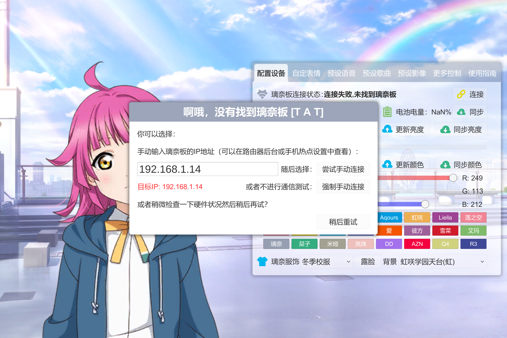
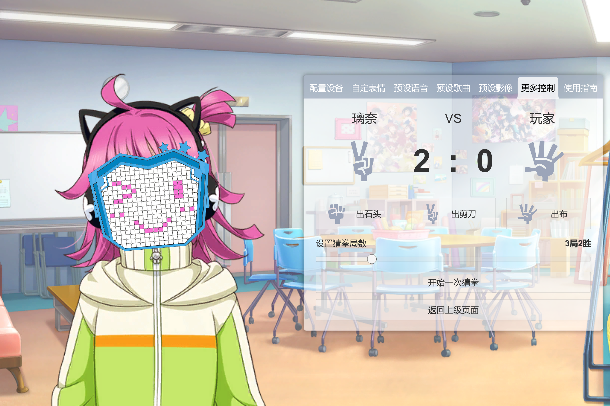

## 8. 上位机页面设计

在本项目中，所有的页面代码位于根目录`${OC}/Assets/Scripts/Pages`。

### 8.1 `IPage`类

本项目中所有的页面组件均继承此类型：

```c#
public class IPage : MonoBehaviour
{
    public Transform MainTransform { get; protected set; }
}
```

页面的脚本在本项目中通常并非绑定在页面组件本身，而是绑定在页面组件的父组件上（这样可以保证一些数据不会在页面隐藏时被销毁或重置），`MainTransform`的作用就是定位到页面组件本身，只需要在初始化时进行一次定位即可而不需要每次调用时重复搜索定位，提升性能。

### 8.2 界面布局与UI皮肤更换

上位机的界面布局如下图所示：


屏幕左侧为璃奈的立绘，右侧为采用了亚克力材质设计的软件控制面板。通过组件`RinaChanDressManager`可以实现对璃奈立绘的服饰、是否露脸以及显示背景进行修改：


### 8.3 配置设备页面

在该页面点击控制面板右上角的连接按钮，系统会自动开始在局域网内查找下位机。如果在请求超时时间（默认1秒）内不能查找到，系统弹出手动连接窗口，用户需要选择进行手动连接或稍后再试：



如果成功与下位机建立连接，璃奈立绘脸上会出现璃奈板UI，页面变为如下图所示：


该页面会显示璃奈板的IP地址、固件版本、电池电量、LED亮度、LED颜色等各项信息，用户也可以通过该页面来修改下位机的LED亮度、LED颜色。每次上位机本地修改亮度、颜色后，需要点击对应的更新按钮将修改内容发送到下位机后修改方可生效。点击对应的同步按钮可以将当前的上位机本地状态修改为当前下位机的状态。

### 8.4 自定表情页面

该页面只有当上位机连接到璃奈板后才能进入。进入该页面时，左侧璃奈立绘消失，璃奈板UI会放大以供用户点击修改。


用户可以直接点击方格来改变LED灯珠的开闭状态，也可以在控制面板上选择已经预设好的表情模块来组合表情。每次上位机本地修改表情后，需要点击对应的更新按钮将修改内容发送到下位机后修改方可生效。点击对应的同步按钮可以将当前的上位机本地状态修改为当前下位机的状态。

### 8.5 预设语音页面

该页面只有当上位机连接到璃奈板后才能进入。


可以点击控制面板上各条语音文字左侧的播放按钮来播放预设语音，璃奈板的表情会随之产生变化。播放预设语音时启用互斥锁，此时不能够切换到其他页面。

### 8.6 预设歌曲页面

该页面只有当上位机连接到璃奈板后才能进入。


可以在控制面板的右侧边栏选择预设歌曲随后点击播放按钮播放，璃奈板的表情会随之产生变化。播放预设歌曲时启用互斥锁，不能切换歌曲、拖动进度条、切换页面。

### 8.7 预设影像页面

该页面只有当上位机连接到璃奈板后才能进入。


可以在控制面板的顶栏选择预设影像随后点击播放按钮播放，璃奈板的表情会随之产生变化。播放预设影像时启用互斥锁，不能切换影像、拖动进度条、切换页面。

### 8.8 更多控制页面

该页面只有当上位机连接到璃奈板后才能进入。该页面分为若干个子页面，进入子页面后启用互斥锁，不能切换页面。

#### 8.8.1 播放滚动文字

该页面支持发送一条最大长度为30的ASCII字符串到璃奈板，璃奈板滚动播放该字符串。


包含一个可以输入文字的输入框、滚动速度调节滑动条、发送按钮；同时提供了两条常用预设文字的快捷发送按钮。播放滚动文字时启用互斥锁，不能编辑输入框、调节播放速度、返回上级页面。可以按停止播放文字按钮中断播放。

#### 8.8.2 小游戏

该页面支持与璃奈板玩一些互动小游戏，目前仅试装了猜拳游戏作为示例。



开始一局游戏后会启用互斥锁，不能修改游戏设置、返回上级页面。可以中断游戏。

#### 8.8.3 口型同步

该页面用于展示口型同步功能，详情可查阅文档：**[附录1-口型同步](./附录1-口型同步.md)**。


用户的可选项为调节麦克风灵敏度（影响最低触发口型同步的音量）、同步刷新速率（影响表情变化速度）、识别模型（包括标准、男声、女声、动漫四种预设模型）。开始口型同步后启用互斥锁，不能修改选项、返回上级页面。

### 8.9 使用指南页面

该页面上半部分为软件的一些使用指南说明，下半部分为项目Logo和所有开发成员、支持成员的展示。


